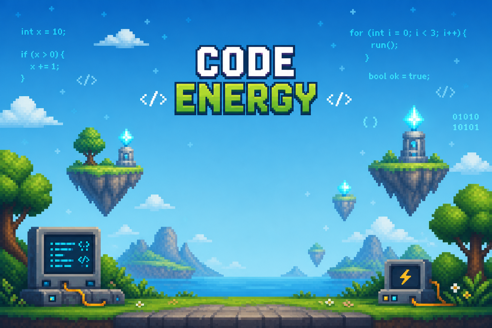
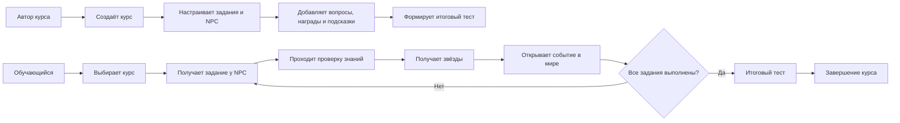

# CodeEnergy

> Интерактивная 3D-система обучения и конструктор учебных курсов, разработанные как дипломный проект на Unity.


<p align="center">
  
</p>

CodeEnergy объединяет конструктор учебного контента и игровую среду от первого лица. Автор курса создаёт темы, задания, проверочные вопросы, подсказки и итоговый тест, а обучающийся выбирает курс, взаимодействует с NPC, отвечает на вопросы, получает звёзды и открывает изменения в игровом мире.

Проект ориентирован на курсы по программированию, однако текущая версия проверяет знания с помощью вопросов и тестов: встроенного редактора кода, компилятора и автоматической проверки программ в репозитории нет.

## Содержание

- [О проекте](#о-проекте)
- [Возможности](#возможности)
- [Роли и доступ](#роли-и-доступ)
- [Как устроен учебный процесс](#как-устроен-учебный-процесс)
- [Конструктор курсов](#конструктор-курсов)
- [Игровая механика](#игровая-механика)
- [Архитектура](#архитектура)
- [Хранение и перенос данных](#хранение-и-перенос-данных)
- [Тестирование](#тестирование)
- [Технологии](#технологии)
- [Запуск проекта](#запуск-проекта)
- [Управление](#управление)
- [Структура репозитория](#структура-репозитория)
- [Ограничения прототипа](#ограничения-прототипа)

## О проекте

CodeEnergy — самостоятельное desktop-приложение, в котором учебная программа превращается в последовательность игровых поручений. Вместо обычного списка уроков пользователь исследует 3D-локацию, получает задания у персонажей, передаёт результаты другим NPC и проходит проверку знаний.

В проекте реализованы два связанных сценария:

| Сценарий | Что получает пользователь |
| --- | --- |
| Автор курса | Создание и редактирование курсов, заданий, вопросов, наград, подсказок и финального теста |
| Обучающийся | Выбор курса, прохождение заданий в 3D-мире, накопление звёзд, открытие событий и итоговая аттестация |

Ключевая особенность проекта — связь учебного прогресса с состоянием игрового мира. Выполненные задания могут включать освещение, запускать генератор, открывать двери или активировать портал. Благодаря этому результат обучения отображается не только числом баллов, но и видимыми изменениями окружения.

## Возможности

### Для обучающегося

- выбор доступного курса перед началом прохождения;
- исследование трёхмерной локации от первого лица;
- взаимодействие с NPC, выдающими и принимающими задания;
- вопросы с одним или несколькими правильными ответами;
- ограничение времени на выполнение задания;
- система подсказок, приобретаемых за накопленные звёзды;
- награда от одной до трёх звёзд с учётом ошибок и времени;
- отображение активного задания и баланса звёзд в HUD;
- сохранение прогресса, положения игрока и состояния мира;
- продолжение ранее начатой игры из главного меню;
- финальный тест, доступный после выполнения всех заданий курса;
- повторная попытка при провале итоговой аттестации.

### Для автора курса

- создание, переименование и удаление курсов;
- добавление и редактирование заданий внутри выбранного курса;
- назначение NPC, который выдаёт задание, и NPC, который принимает ответ;
- настройка диалогов, вопроса, количества вариантов ответа и правильных вариантов;
- выбор максимальной награды, лимита времени и стоимости подсказки;
- привязка успешного ответа к событию игрового мира;
- создание итогового теста и настройка проходного балла;
- импорт и экспорт учебных данных в JSON;
- создание резервных копий и восстановление последней копии;
- открытие папки с локальными данными из интерфейса приложения.

## Роли и доступ

В приложении используются два режима работы.

| Возможность | Обучающийся | Администратор / автор курса |
| --- | :---: | :---: |
| Выбор и прохождение курса | ✓ | — |
| Взаимодействие с NPC и прохождение тестов | ✓ | — |
| Создание и изменение курсов | — | ✓ |
| Редактирование заданий и итоговой аттестации | — | ✓ |
| Импорт, экспорт и резервное копирование | — | ✓ |

Переход в административный режим защищён паролем и ограничением количества попыток. После успешной проверки в общем состоянии приложения устанавливается признак `IsAdminMode`, на основании которого открываются инструменты управления контентом.

> **Важно:** это разграничение интерфейсных режимов внутри локального Unity-приложения, а не серверная система авторизации. Пароль хранится на стороне клиента, учётных записей, хеширования паролей и backend-проверки прав в текущей версии нет. Поэтому механизм подходит для учебного прототипа и демонстрации, но требует переработки перед использованием в production.

## Как устроен учебный процесс



Система `TaskAssignmentManager` отбирает задания выбранного курса и формирует очереди для NPC. Очереди, активное задание и завершённые этапы сохраняются, поэтому после перезапуска прохождение продолжается с актуального состояния.

## Конструктор курсов

### Модель курса

Курс содержит уникальный идентификатор, название, список связанных заданий и необязательный итоговый тест.

Каждое учебное задание позволяет настроить:

- название и принадлежность к курсу;
- NPC-инициатора и NPC-получателя по стабильным GUID;
- текст диалога при выдаче и сдаче задания;
- вопрос и от двух до пяти вариантов ответа;
- один или несколько правильных вариантов;
- лимит времени;
- максимальную награду от одной до трёх звёзд;
- подсказку и её стоимость;
- событие, которое произойдёт в игровом мире после успеха.

Редакторы выполняют проверку обязательных полей: нельзя сохранить задание без названия, вопроса, корректного набора ответов, выбранного правильного варианта или допустимого времени.

### Итоговая аттестация

Для курса можно создать финальный тест, состоящий из произвольного набора вопросов. У каждого вопроса поддерживаются 2–5 вариантов и множественный выбор. Автор курса задаёт минимальное число правильных ответов, необходимое для прохождения.

Финальный портал становится доступен только после завершения всех заданий выбранного курса. После теста пользователь видит количество правильных ответов, проходной порог и процент результата.

## Игровая механика

### Награды

Награда рассчитывается автоматически и выдаётся для каждого задания только один раз.

| Результат | Базовая награда |
| --- | ---: |
| Без ошибок, в пределах времени | 3 звезды |
| Без ошибок, но после истечения времени | 2 звезды |
| Одна неверная попытка | 2 звезды |
| Две и более неверные попытки | 1 звезда |

Фактическая награда дополнительно ограничивается значением `maxStars`, заданным автором курса. Звёзды можно потратить на подсказку стоимостью от одной до трёх звёзд.

### События мира

В модели задания предусмотрены следующие результаты прохождения:

- `FixLanterns` — восстановить освещение;
- `UnlockDoors` — разблокировать двери;
- `StartGenerator` — запустить генератор;
- `ActivatePortal` — активировать портал;
- `CompleteIsland` — завершить этап локации.

Компоненты окружения подписываются на изменение прогресса и обновляют своё состояние. Отдельные зоны могут открываться по конкретному заданию, количеству выполненных заданий или событию мира.

## Архитектура

Проект построен вокруг разделения данных, состояния прохождения, игровой логики и UI.

| Область | Основные компоненты | Ответственность |
| --- | --- | --- |
| Учебные данные | `CourseModel`, `TaskModel`, `FinalTestModel`, `DataManager` | Модели курсов, заданий и тестов; чтение и нормализация JSON |
| Состояние игры | `GameState`, `GameStateData`, `SaveManager` | Прогресс, звёзды, задания, события мира и восстановление сессии |
| Надёжность данных | `SaveService` | Миграция файлов, валидация, резервные копии, импорт и экспорт |
| Назначение заданий | `TaskAssignmentManager`, `NpcIdentity`, `NpcInteractable` | Связь заданий с NPC и восстановление очередей |
| Проверка знаний | `QuizPanelController`, `FinalTestController` | Викторины, подсказки, награды и итоговая аттестация |
| Редакторы | `CourseListManager`, `TaskEditorController`, `FinalTestEditorController` | CRUD-операции над учебным контентом |
| Игровой мир | `WorldEventKey`, `ProgressGate`, компоненты окружения | Изменение сцены в зависимости от прогресса |
| Интерфейс | `UIManager`, HUD, меню, настройки и диалоги | Навигация, обратная связь и обработка пользовательских ошибок |

Событийная модель `GameState` уведомляет интерфейс и игровые объекты об изменении числа звёзд, выполнении задания или наступлении события мира. Это уменьшает связанность между учебной логикой и конкретными объектами сцены.

## Хранение и перенос данных

Данные сохраняются локально в каталоге:

```text
Application.persistentDataPath/GameData
├── courses.json
├── tasks.json
├── gamestate.json
├── Backups/
├── Transfer/
└── save_service_log.txt
```

- `courses.json` хранит курсы и итоговые тесты;
- `tasks.json` хранит учебные задания;
- `gamestate.json` хранит выбранный курс, прогресс, звёзды, очереди NPC, события мира и позицию игрока.

Запись состояния выполняется через временный файл с последующей заменой основного. `SaveService` создаёт резервные копии изменяемых файлов, хранит до десяти копий каждого файла, формирует общие backup-наборы и проверяет структуру импортируемого JSON до замены рабочих данных.

Модели также содержат нормализацию и миграцию устаревших полей, что позволяет открывать данные, созданные предыдущими версиями проекта.

## Тестирование

В репозитории находится **131 Edit Mode-тест** на базе Unity Test Framework.

| Набор тестов | Количество | Что проверяется |
| --- | ---: | --- |
| `AdminPasswordControllerTests` | 12 | Пароль, число попыток и переход в режим администратора |
| `CourseManagementTests` | 15 | Создание, изменение и удаление курсов |
| `GameStateDataTests` | 15 | Структура и сериализация прогресса |
| `JsonStructureValidationTests` | 22 | Проверка импортируемых JSON-данных |
| `RewardAndProgressTests` | 20 | Награды, ошибки, подсказки и завершение заданий |
| `SaveSystemTests` | 12 | Сохранение, резервные копии и восстановление |
| `SettingsControllerTests` | 18 | Разрешение, звук и пользовательские настройки |
| `TaskItemTests` | 17 | Поведение элементов списка заданий |

Запуск из редактора Unity:

1. Открыть `Window → General → Test Runner`.
2. Перейти на вкладку `EditMode`.
3. Нажать `Run All`.

Запуск из командной строки:

```powershell
<UNITY_EDITOR_PATH> -batchmode -projectPath . -runTests -testPlatform EditMode -testResults TestResults.xml -quit
```

Число тестов указано по исходному коду репозитория; публичный CI-процесс и опубликованный отчёт о последнем прогоне в текущей версии отсутствуют.

## Технологии

- Unity `6000.3.6f1`;
- C#;
- Universal Render Pipeline `17.3.0`;
- Unity Input System `1.18.0`;
- AI Navigation `2.0.9`;
- TextMesh Pro и uGUI;
- Unity Test Framework `1.6.0`;
- JSON-сериализация через `JsonUtility`;
- `PlayerPrefs` и `AudioMixer` для настроек;
- Character Controller для перемещения от первого лица.

В проекте также используются сторонние визуальные пакеты: AllSky Free, Low Poly People, Low Poly Fantasy Village, QuickOutline и Unvik 3D.

## Запуск проекта

### Требования

- Unity Hub;
- Unity Editor `6000.3.6f1`;
- Git;
- Windows рекомендуется как основная целевая платформа текущего прототипа.

Git LFS для этого репозитория не настроен: крупные ассеты хранятся непосредственно в истории Git, поэтому первоначальное клонирование может занять время.

### Установка

```bash
git clone https://github.com/okutagawa/CodeEnergy.git
cd CodeEnergy
```

1. Добавить папку проекта в Unity Hub.
2. Открыть проект версией Unity `6000.3.6f1`.
3. Дождаться импорта ассетов и установки пакетов.
4. Открыть сцену `Assets/Scenes/MenuScene.unity`.
5. Нажать `Play`.

В Build Settings уже зарегистрированы две основные сцены:

1. `Assets/Scenes/MenuScene.unity`;
2. `Assets/Scenes/GameScene.unity`.

Для локальной демонстрации пароль хранится в сериализованном поле `expectedPassword` компонента `AdminPasswordController`; значение по умолчанию в исходном коде — `admin`. Перед публичным показом его следует изменить в Inspector.

## Управление

| Действие | Клавиша / устройство |
| --- | --- |
| Перемещение | `WASD` или стрелки |
| Обзор | мышь |
| Прыжок | `Space` |
| Взаимодействие с NPC и объектами | `E` |
| Пауза | `Esc` |
| Работа с меню и тестами | мышь |

Система управления курсором отключает вращение камеры при открытых окнах интерфейса и возвращает управление после их закрытия.

## Структура репозитория

```text
CodeEnergy/
├── Assets/
│   ├── Art/                    # UI, модели, материалы и визуальные ресурсы
│   ├── Resources/
│   │   └── NPCPrefabs/         # NPC со стабильными идентификаторами
│   ├── Scenes/
│   │   ├── MenuScene.unity
│   │   └── GameScene.unity
│   └── Scripts/
│       ├── Data/               # Модели, состояние и сериализация
│       ├── Environment/        # Реакции окружения на прогресс
│       ├── Interaction/        # NPC, задания, тесты и взаимодействие
│       ├── Panels/             # Меню, HUD и редакторы контента
│       ├── Player/             # Перемещение и камера
│       └── Tests/Editor/       # Edit Mode-тесты
├── Packages/                   # Зависимости Unity
├── ProjectSettings/            # Настройки проекта и сборки
└── README.md
```

## Что демонстрирует проект

С инженерной точки зрения CodeEnergy показывает опыт работы со следующими задачами:

- проектирование связанных моделей данных для курсов, заданий и тестов;
- реализация CRUD-интерфейсов внутри Unity;
- построение событийной системы состояния приложения;
- сохранение, миграция, валидация, импорт и резервное копирование JSON;
- реализация игрового цикла, экономики наград и условий прогресса;
- связывание учебного контента с объектами 3D-сцены;
- разработка интерфейсов для двух пользовательских сценариев;
- автоматизированное Edit Mode-тестирование ключевой бизнес-логики.

## Ограничения прототипа

- разграничение ролей реализовано локально и не заменяет полноценную аутентификацию и RBAC;
- данные хранятся в локальных JSON-файлах, без базы данных и облачной синхронизации;
- учебные ответы проверяются как тесты — выполнения и анализа программного кода нет;
- локализация и отдельная система управления текстовым контентом не реализованы;
- автоматическая CI-сборка и готовый релиз в репозитории отсутствуют;
- лицензия проекта в корне репозитория не указана.

Возможное развитие проекта: вынести аутентификацию и курсы на backend, добавить аккаунты и серверные права доступа, встроить безопасную песочницу для запуска кода, реализовать аналитику обучения, облачную синхронизацию и CI/CD для сборок.

---

**CodeEnergy** — дипломный проект, исследующий, как игровые механики, интерактивная среда и визуальный конструктор контента могут сделать обучение программированию более вовлекающим.
